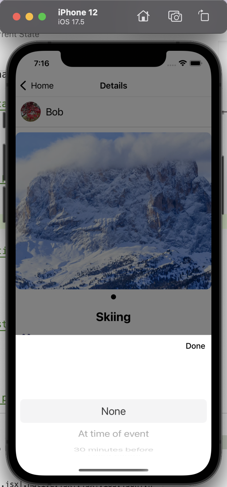
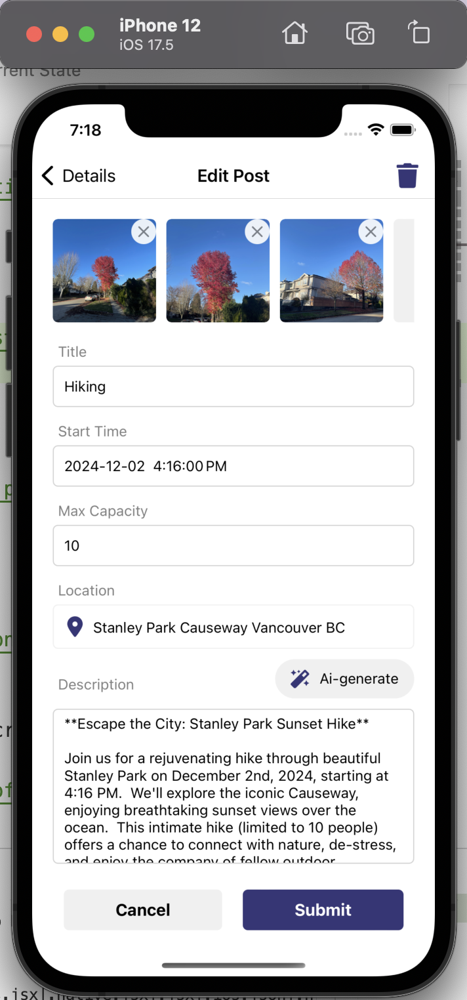

# Project Title

Vibe

## Table of Contents

- [Installation](#installation)
- [Contributing](#contributing)
- [Current State](#current-state)

## Installation

Instructions on how to install and set up the project.

```bash
# Clone the repository
git clone https://github.com/lqingman/vibe.git
```

# Install dependencies
npm install

## Current State
We have React Native components created to represent the functionality we will be building, and the overall structure of our app is in place.

Navigation and the basis of CRUD operations to Firestore is established and working.

Home Page(Explore screen):


Joined screen:


ChangeLocation screen:


Filter modal:


Details screen when user haven't joined:


Details screen when user have joined:


Comments scetion:


Notification Modal:


CreatePost screen:


EditPost screen:


Profile screen:


Setting(update profile) scrren:


# 3 firebase collections
1. users
This collection stores information about users where every user is:
user = {
    name: string,
    email: email,
    uid: uid,
    picture: '',
    bio: '',
    age: '',
    gender: '',
    posts: [],
    favorites: [],
    joined: []
}

2. posts
This collection stores information about posts where every post is:
post = {
    title: '',
    keywords: [],
    date: Date,
    time: Time,
    description: '',
    location: location,
    image: 'https://nrs.objectstore.gov.bc.ca/kuwyyf/hiking_1110x740_72dpi_v1_d2c8d390f0.jpg',
    limit: int,
    owner: uid,
}

3. comments
This is a sub-collection in the collection 'posts'. It stores information about the comments of a specific post, where each comment is:
comment = {
        owner: uid
        text: string
        timestamp: Date(),
      };

The database looks like the following sreenshots:


# CRUD operations


## Contribution
# Joy:
Firebase:
Implemented getUserData, getPostData, searchByTitleKeyword, addCommentToPost, fetchComments, addOrUpdateNotification
functions in file firestoreHelper.js

Components:
Implemented ActivityCard, CusPressable, FavoriteButton,StaticDetail components

Screens:
Implemented ChangeLocation, Details, Explore, Joined 
screens

Styles:
Implemented Style and Color files

App.js:
Implemented all navigation structure expect for the auth stack, including  HomeTopTabs, tabNavigator, and StackNavigator.


```

