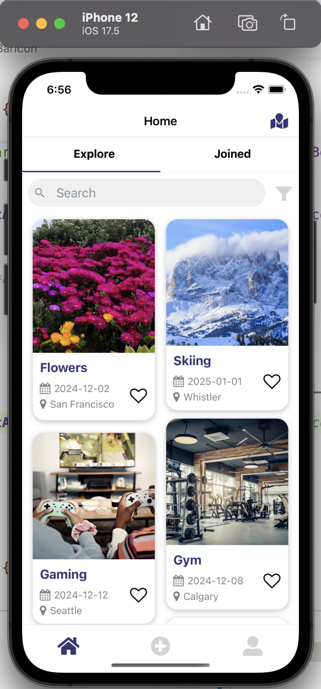
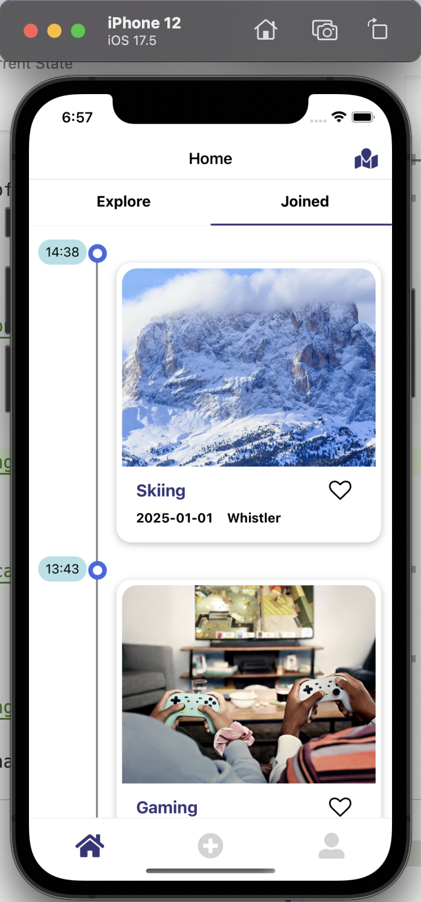
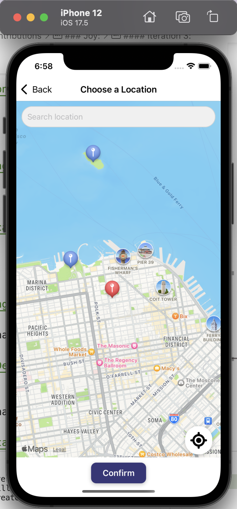
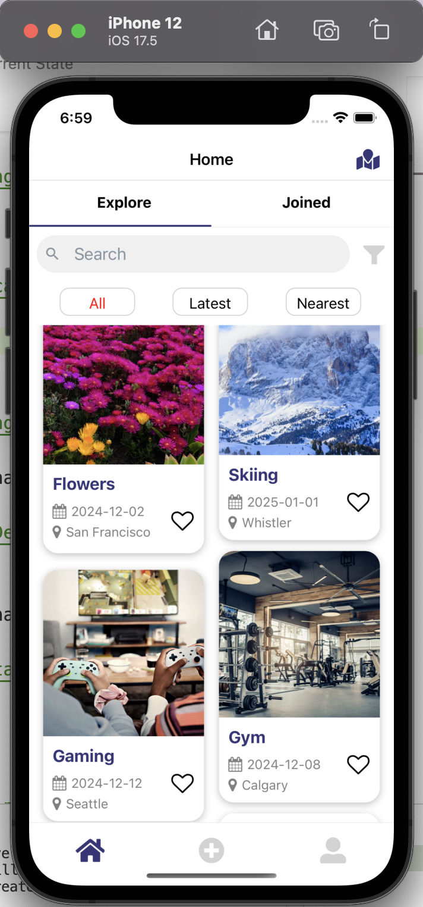
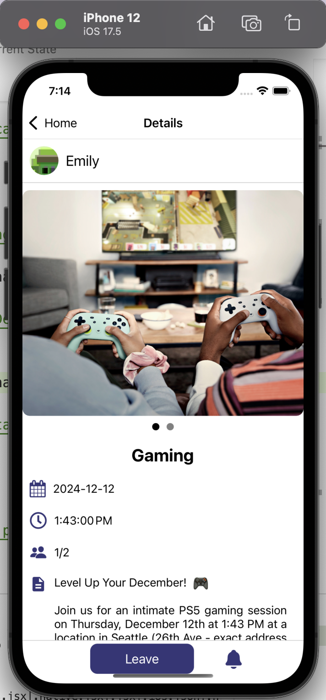
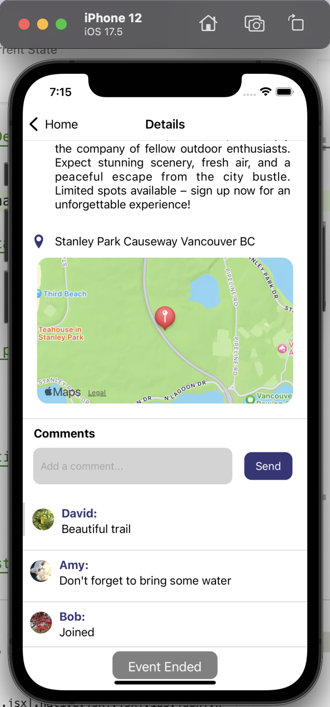
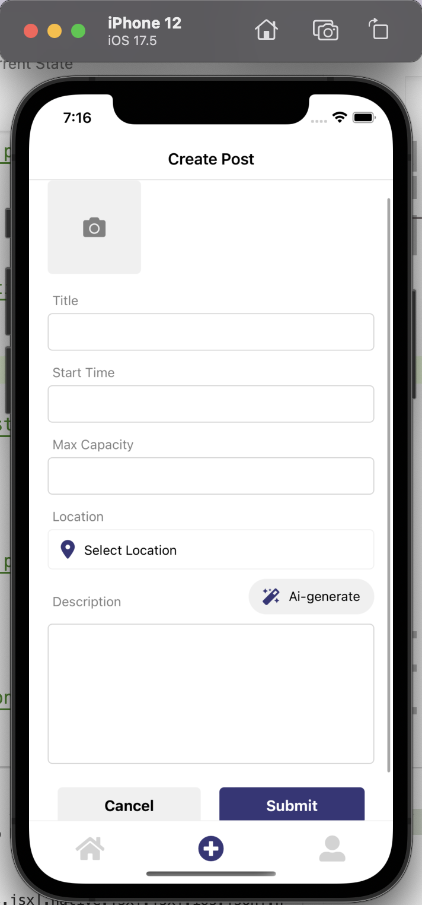
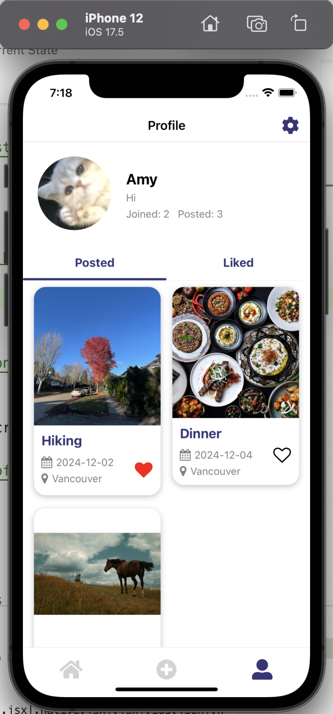
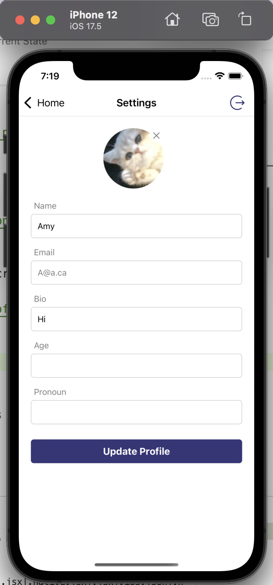

# Project Title

Vibe

## Table of Contents

- [Installation](#installation)
- [Contributing](#contributing)
- [Current State](#current-state)
- [FirebaseCollection](#firebase-collections)
- [CRUDoperations](#crud-operations)
- [Contributions](#contributions)

## Installation

Instructions on how to install and set up the project.

```bash
# Clone the repository
git clone https://github.com/lqingman/vibe.git
```

## Install dependencies
npm install

## Current State
We have React Native components created to represent the functionality we will be building, and the overall structure of our app is in place.

Navigation and the basis of CRUD operations to Firestore is established and working.

Home Page(Explore screen): 



Joined screen: 



ChangeLocation screen: 



Filter modal: 



Details screen when user haven't joined: 


Details screen when user have joined: 



Comments section: 



Notification Modal: 


CreatePost screen: 



EditPost screen: 


Profile screen: 



Setting(update profile) screen: 




## Firebase Collections
### 1. users
    This collection stores information about users where every user is:
    user = {
        name: string,
        email: email,
        uid: uid,
        picture: '',
        bio: '',
        age: '',
        gender: '',
        posts: [],
        favorites: [],
        joined: []
    }

### 2. posts
    This collection stores information about posts where every post is:
    post = {
        title: '',
        keywords: [],
        date: Date,
        time: Time,
        description: '',
        location: location,
        image: 'https://nrs.objectstore.gov.bc.ca/kuwyyf/hiking_1110x740_72dpi_v1_d2c8d390f0.jpg',
        limit: int,
        owner: uid,
    }

### 3. comments
    This is a sub-collection in the collection 'posts'. It stores information about the comments of a specific post, where each comment is:
    comment = {
            owner: uid
            text: string
            timestamp: Date(),
        };

The database looks like the following sreenshots:


## CRUD operations
### Users Collection
#### Create
    Function: writeToDB(data, 'users', userId)
    when user sign up a new account, the database will automatically create a new user document and also get the user id from authentication to the users collection.
#### Read
    Function: getUserData(userId)
    Retrieves the user document from the users collection with the specified userId.
#### Update
    Function: updateUserProfile(userId, updatedData), updateArrayField('users', userId, field, value), deleteArrayField('users', userId, field, value), addOrUpdateNotification(postId, time)
    Updates the user document in the users collection with the specified userId using the provided updatedData in setting page. When user posted, liked or joined a certain post, it will update the posts, favorites, joined array field of the user document. When user set notification for a post, the data will also update to the notification field of user document.

### Posts Collection
#### Create
    Function: writeToDB(data, 'posts')
    Adds a new post document to the posts collection. It will convert title into keywords for future searching. It will also update the posts field for user profile.
#### Read
    Function: getPostData(postId), searchByTitleKeyword(keyword)
    Retrieves the post document from the posts collection with the specified postId. When user search on explore page, it would search through the keywords from all posts.
#### Update
    Function: updatePost(postId, updatedData)
    Updates the post document in the posts collection with the specified postId using the provided updatedData for edit page. When user join or unjoin a certain post, the post will also update the attendee array field.
#### Delete
    Function: deletePost(postId, userId)
    First deletes all comments in the comments sub-collection with the specified postId. Deletes the post document from the posts collection and removes the post ID from the user's posts array. 

### Comments Collection
#### Create
    Function: addCommentToPost(postId, commentData)
    Adds a new comment document to the comments sub-collection of the specified post.
#### Read
    Function: fetchComments(postId)
    Retrieves all comment documents from the comments sub-collection of the specified post.


## Contributions
### Joy:
- Firebase:
    `Implemented getUserData, getPostData, searchByTitleKeyword, addCommentToPost, fetchComments, addOrUpdateNotification functions in file firestoreHelper.js`

- Components:
    `Implemented ActivityCard, CusPressable, FavoriteButton, StaticDetail components`

- Screens:
    `Implemented ChangeLocation, Details, Explore, Joined screens`

- Styles:
    `Implemented Style and Color files`

- App.js:
    `Implemented all navigation structure, including  HomeTopTabs, tabNavigator, StackNavigator.`

### Alina:
- Firebase:
    `Implemented writeToDB, updateArrayField, deleteArrayField, updateUserProfile, updatePost, deletePost functions in file firestoreHelper.js`

- Screens:
    `Implemented Login, Signup, Profile, Setting screens, implement CreatePost screen for create new post and edit post page, implement PostsList screen as two subscreen Posted and Liked page in Profile screen.`

- App.js:
    `Implemented for AuthStack and authentication state listen.`


